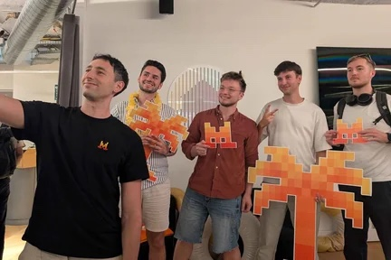
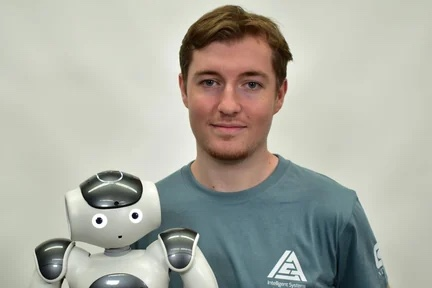

### hey, i'm mathieu

applied ai engineer / fde. prev. airbus.

i love competition. i played basketball at a high level for years, these days i get my fix at hackathons.
if you've got a project and think i could help, feel free to reach out, always happy to build stuff.

[mathieuastruc.com](https://mathieuastruc.com) · [linkedin](https://www.linkedin.com/in/mathieu-astruc/) · [x](https://x.com/matheusnpu) · [mail](mailto:mathastruc@gmail.com)

&nbsp;

#### projects

<table>
  <tr>
    <td width="64%">
       <b><a href="https://github.com/MistralGagnant/impostralv2">Impostral</a></b> 
      Mistral agents infiltrating a real-time social deduction game. 1st in our track, finalist at the Mistral AI Hackathon. 
      <a href="https://youtu.be/wsBaHW688Lc">demo</a>
    </td>
    <td align="center">
       
      track winner · mistral ai hackathon 2026
    </td>
  </tr>
  <tr>
    <td width="64%">
       <b><a href="https://youtu.be/QZ8oGMaRq6M">Humanoid robot interaction stack</a></b> 
      Gesture recognition and an embedded LLM running on a humanoid robot at NTNU. 
      <a href="https://youtu.be/QZ8oGMaRq6M">video</a>
    </td>
    <td align="center">
       
      with nao · ntnu, norway 2025
    </td>
  </tr>
  <tr>
    <td width="64%">
       <b><a href="https://link.springer.com/chapter/10.1007/978-3-032-29586-6_1">HCI International 2026 paper</a></b> 
      Lead author of an accepted HRI paper on real-time gesture recognition. Springer.
    </td>
    <td align="center"><a href="https://link.springer.com/chapter/10.1007/978-3-032-29586-6_1">paper</a></td>
  </tr>
  <tr>
    <td width="64%">
       <b>AI content creation</b> 
      Breaking down AI concepts and news for 45k+ followers.
    </td>
    <td align="center">
      <a href="https://www.instagram.com/matheusgen_/">instagram</a> · <a href="https://www.tiktok.com/@matheusgen">tiktok</a> · <a href="https://www.youtube.com/@MatheusGen">youtube</a>
    </td>
  </tr>
</table>

&nbsp;

#### hackathons

| participated | finalist | track winner |
| :---: | :---: | :---: |
| **1** | **1** | **1** (top 3) |
